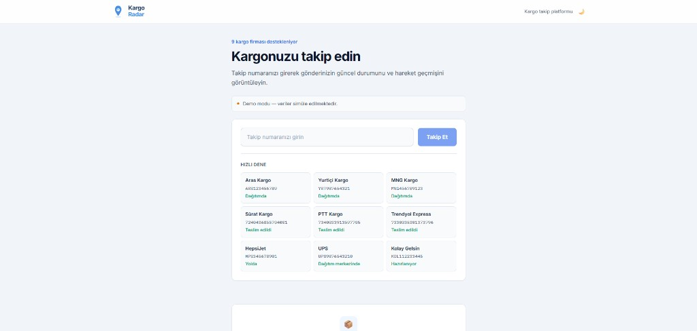

# Kargo Radar

Farklı kargo firmalarına ait gönderilerin tek bir uygulama üzerinden takip edilebildiği kargo takip uygulaması. **9 kargo firması** desteklenir; farklı API formatları ortak bir yapıya dönüştürülür.

- **Canlı:** https://kargo-radar.vercel.app
- **Repo:** https://github.com/aksoyece/kargo-radar

## Desteklenen Firmalar

Aras Kargo · Yurtiçi Kargo · MNG Kargo · PTT Kargo · Trendyol Express · Sürat Kargo · HepsiJet · UPS · Kolay Gelsin

## Ekran Görüntüsü



## Teknolojiler

- **Nuxt.js 4** + **Vue.js 3**
- **Bootstrap 5**
- **PWA** (ana ekrana eklenebilir)
- **Koyu / açık tema**
- **Pinia** (state yönetimi)
- **LocalStorage** (arama geçmişi)
- **AfterShip Tracking API** (gerçek kargo verisi)

## Kurulum

```bash
npm install
cp .env.example .env
npm run dev
```

Uygulama `http://localhost:3000` adresinde çalışır.

## Demo Takip Numaraları (Mock Mod)

| Firma | Takip Numarası | Örnek Durum |
|-------|----------------|-------------|
| Aras Kargo | `ARS123456789` | Dağıtımda |
| Yurtiçi Kargo | `YRT987654321` | Dağıtımda |
| MNG Kargo | `MNG456789123` | Dağıtımda |
| Sürat Kargo | `7240436855704001` | Teslim edildi |
| PTT Kargo | `7340033913597705` | Teslim edildi |
| Trendyol Express | `7330035301373796` | Teslim edildi |
| HepsiJet | `HPS345678901` | Yolda |
| UPS | `UPS9876543210` | Dağıtım merkezinde |
| Kolay Gelsin | `KOL112233445` | Hazırlanıyor |
| Aras Kargo (sorun) | `ARS888777666` | Sorun oluştu |

## Canlıya Geçiş (AfterShip)

Altyapı hazır. Aktifleştirmek için:

1. [AfterShip](https://www.aftership.com/) hesabı aç (Tracking API — Premium plan gerekir)
2. [API anahtarı](https://organization.automizely.com/api-keys) al
3. **Vercel** → Project → Settings → Environment Variables:

```env
NUXT_PUBLIC_USE_AFTERSHIP=true
AFTERSHIP_API_KEY=asat_xxxxxxxx
```

4. Redeploy et

**Davranış:**
- Demo numaraları (`ARS123…`, `HPS345…` vb.) → mock veri (portfolyo demosu için)
- Diğer tüm numaralar → AfterShip üzerinden gerçek takip

Yerel test için `.env` dosyasına aynı değişkenleri ekle.

## AfterShip Entegrasyonu (Teknik)

Gerçek kargo verileri için [AfterShip Tracking API](https://www.aftership.com/docs/tracking/quickstart/api-quick-start) kullanılır.

1. [AfterShip](https://www.aftership.com/) hesabı oluşturun
2. [API anahtarı](https://organization.automizely.com/api-keys) alın
3. `.env` dosyasını yapılandırın:

```env
NUXT_PUBLIC_USE_AFTERSHIP=true
AFTERSHIP_API_KEY=your_api_key_here
```

### API Akışı

AfterShip quick start dokümantasyonuna uygun olarak:

1. `GET /trackings?tracking_numbers=` — mevcut kayıt aranır
2. `POST /couriers/detect` — kargo firması otomatik tespit edilir
3. `POST /trackings` — yeni takip kaydı oluşturulur
4. Yanıt `aftershipAdapter.ts` ile ortak formata dönüştürülür

- **Base URL:** `https://api.aftership.com/tracking/2026-07`
- **Kimlik doğrulama:** `as-api-key` header'ı

## Mimari

Uygulama, farklı kaynaklardan gelen verileri ortak `NormalizedShipment` formatına dönüştürür:

| Kaynak | Response Yapısı |
|--------|-----------------|
| Aras Kargo (mock) | `{ status, city, history[] }` |
| Yurtiçi Kargo (mock) | `{ current_status, location: { city }, movements[] }` |
| MNG Kargo (mock) | `{ data: { shipment, trackingDetails[] } }` |
| PTT Kargo (mock) | `{ sonuc: { takipNo, durumKodu, detaylar[] } }` |
| Trendyol Express (mock) | `{ shipment, timeline[] }` |
| Sürat Kargo (mock) | `{ response, statusHistory[] }` |
| HepsiJet (mock) | `{ current_status, location, movements[] }` |
| UPS (mock) | `{ trackResponse: { shipment, package, activity[] } }` |
| Kolay Gelsin (mock) | `{ data: { shipment, trackingDetails[] } }` |
| AfterShip API | `{ tag, checkpoints[], slug, ... }` |

Adapter katmanları:
- `services/adapters.ts` — mock API'ler
- `services/aftershipAdapter.ts` — AfterShip API
- `server/services/aftership.ts` — AfterShip HTTP istemcisi

## Standart Kargo Durumları

- Hazırlanıyor
- Yolda
- Dağıtım Merkezinde
- Dağıtımda
- Teslim Edildi
- Sorun Oluştu
